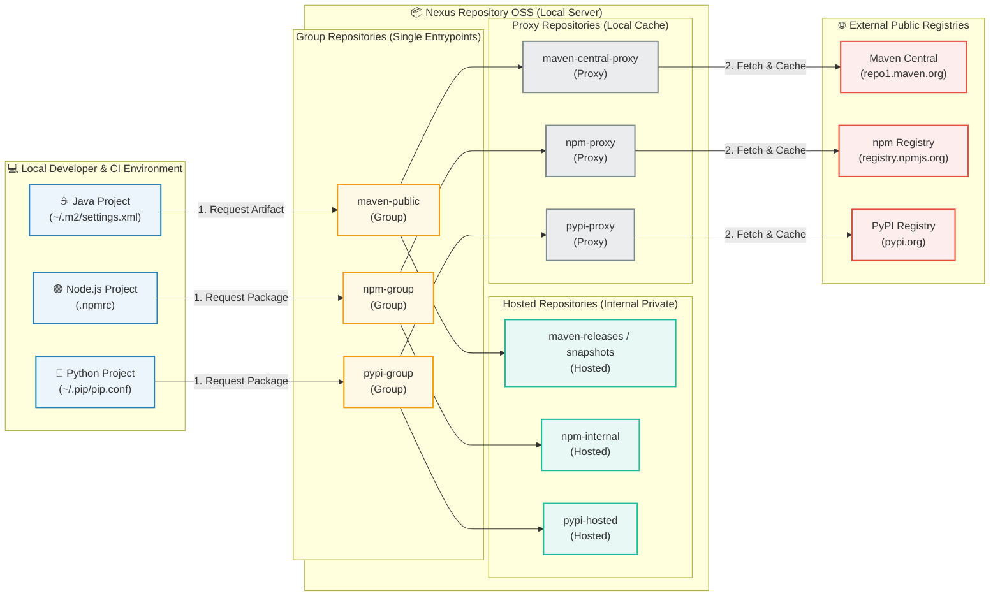

# Nexus Repository 실무 초급: 모듈 2. 아티팩트 저장소 아키텍처 구성


## 1. 개요 및 배경 (Overview)

- 저장소 타입(Hosted, Proxy, Group)의 역할
- Maven, npm 등 언어별 패키지 저장소 구성

### Pain Point (현장의 문제점)

- 언어별로 파편화된 외부 라이브러리 관리의 복잡성과 외부망 장애 시 빌드 지연 현상.

### Solution (해결 방안)

- Proxy 저장소를 통한 캐싱 전략과 Group 저장소를 활용한 단일 엔드포인트 통합 구성을 현업 사례와 함께 보여줍니다.


## 2. 저장소 타입(Hosted, Proxy, Group)의 역할

### 구성도



### Hosted Repository (자체 저장소)

> **"우리가 직접 만든 라이브러리/아티팩트를 보관하는 장소"**

- **역할:** 사내 개발팀이 직접 빌드한 결과물(JAR, npm 패키지 등)이나 외부에서 입수한 내부 전용 라이브러리를 직접 업로드(Push)하여 저장하는 **내부 전용 저장소**입니다.
- **특징:**
  - 읽기/쓰기(Read/Write)가 모두 가능합니다.
  - 외부 인터넷망에 공개되지 않는 **자사 IP/자산**을 관리합니다.
  - 배포 정책에 따라 **Release**(수정 불가능한 완성된 버전)와 **Snapshot**(개발 중인 버전) 저장소로 나뉘어 운영됩니다.
- **예시:** `my-company-common-util-1.0.0.jar`, 사내 프론트엔드 공통 API 컴포넌트 패키지

### Proxy Repository (대리 저장소)

> **"외부 중앙 저장소의 라이브러리를 캐싱(Caching)해주는 저장소"**

- **역할:** Maven Central, npm Registry, Docker Hub 등 외부에 있는 공개 저장소를 바라보고, 요청이 들어온 라이브러리를 **캐시(Cache)하여 내부망에 보관**해주는 저장소입니다.
- **특징:**
  - **읽기 전용(Read-Only)** 및 **자동 캐싱** 방식입니다.
  - **작동 방식:**
    1. 개발자/빌드 서버가 라이브러리를 요청합니다.
    2. Nexus에 해당 라이브러리가 이미 캐싱되어 있다면 **외부로 나가지 않고 즉시 제공**합니다.
    3. 캐싱되어 있지 않다면 **Nexus가 외부 저장소에서 다운로드**하여 사내에 저장한 후 제공합니다.
  - **장점:** 외부 트래픽 감소, 빌드 속도 극대화, 외부 저장소 장애나 네트워크 차단 시에도 캐시된 라이브러리로 빌드 가능.
- **예시:** `maven-central` (Maven Central의 로컬 프록시 저장소), `npm-proxy` (registry.npmjs.org의 로컬 프록시 저장소)

### Group Repository (그룹 저장소)

> **"여러 저장소를 하나로 묶어주는 단일 엔드포인트(URL)"**

- **역할:** 여러 개의 Hosted 저장소와 Proxy 저장소를 하나의 논리적인 그룹으로 묶어, **개발자에게 단 1개의 URL만 제공**하는 역할을 합니다.
- **특징:**
  - 실제 파일이 저장되는 공간이 아닌 가상의 뷰(Logical View)입니다.
  - 개발자는 `pom.xml`이나 `.npmrc`에 여러 개(Hosted, Proxy 등)의 URL을 등록할 필요 없이 **Group 저장소 URL 하나만 설정**하면 됩니다.
  - 요청이 들어오면 Group 내부의 저장소 검색 우선순위에 따라 적절한 아티팩트를 찾아 반환합니다.
- **장점:** 클라이언트(개발자 PC, CI/CD 서버)의 설정 파일 관리가 매우 간결해집니다.


## 3. Maven, npm 등 언어별 패키지 저장소 구성

### Maven 연동 방안 (Java / Kotlin)

#### Nexus 저장소 구성

1. **Proxy:** `maven-central` (URL: `[https://repo1.maven.org/maven2/](https://repo1.maven.org/maven2/)`)
2. **Hosted:** `maven-releases`, `maven-snapshots`
3. **Group:** `maven-public` (위 Proxy와 Hosted 저장소들을 묶음)

#### 클라이언트 설정

개발자 PC의 `~/.m2/settings.xml` 파일에 Nexus Group 저장소 및 인증 정보를 설정합니다.

XML

```
<settings>
  <servers>
    <server>
      <id>nexus</id>
      <username>your-nexus-username</username>
      <password>your-nexus-password</password>
    </server>
  </servers>

  <mirrors>
    <!-- 모든 라이브러리 요청(*)을 Nexus Group 저장소로 미러링 -->
    <mirror>
      <id>nexus</id>
      <mirrorOf>*</mirrorOf>
      <url>http://<nexus-ip>:8081/repository/maven-public/</url>
    </mirror>
  </mirrors>

  <profiles>
    <profile>
      <id>nexus</id>
      <repositories>
        <repository>
          <id>nexus</id>
          <url>http://<nexus-ip>:8081/repository/maven-public/</url>
          <releases><enabled>true</enabled></releases>
          <snapshots><enabled>true</enabled></snapshots>
        </repository>
      </repositories>
    </profile>
  </profiles>

  <activeProfiles>
    <activeProfile>nexus</activeProfile>
  </activeProfiles>
</settings>
```

### npm 연동 방안 (Node.js / JavaScript)

#### Nexus 저장소 구성

1. **Proxy:** `npm-proxy` (URL: `[https://registry.npmjs.org/](https://registry.npmjs.org/)`)
2. **Hosted:** `npm-hosted`
3. **Group:** `npm-group` (Proxy + Hosted)

#### 클라이언트 설정

**프로젝트별 적용 (`.npmrc`)**

프로젝트 루트 디렉토리에 `.npmrc` 파일을 생성하여 해당 프로젝트만 Nexus를 바라보게 설정합니다.

Ini, TOML

```
# Nexus Group 저장소 레지스트리 지정
registry=http://<nexus-ip>:8081/repository/npm-group/

# 사내 자체 패키지 배포(publish) 시 로그인 인증 헤더 (Auth Token 필요 시)
_auth=<base64-encoded-username-password>
```

**전역 CLI 명령어로 적용**

Bash

```
# 글로벌 레지스트리 변경
npm config set registry http://localhost:8081/repository/npm-group/

# 로그인 (Hosted 저장소에 publish가 필요한 경우)
npm login --registry=http://localhost:8081/repository/npm-hosted/
```

## Pypi 연동 방안 (Python)

#### Nexus 저장소 구성

1. **Proxy:** `pypi-proxy` (URL: `[https://pypi.org/](https://pypi.org/)`)
2. **Hosted:** `pypi-hosted`
3. **Group:** `pypi-group` (Proxy + Hosted)

#### 클라이언트 설정

`pip.conf` (또나 `pip.ini`) 설정

유저 홈 디렉토리의 pip 설정 파일(`~/.pip/pip.conf` 또는 Windows `%APPDATA%\pip\pip.ini`)에 Nexus URL을 지정합니다.

Ini, TOML

```
[global]
# Python 패키지 검색 및 설치 URL
index-url = http://<nexus-ip>:8081/repository/pypi-group/simple

# HTTP 사용 시 신뢰할 수 있는 호스트 등록 (HTTPS 사용 시 제외 가능)
trusted-host = <nexus-ip>
```

CLI 명령어로 일회성 설치

Bash

```
pip install <package-name> --index-url http://<nexus-ip>:8081/repository/pypi-group/simple --trusted-host <nexus-ip>
```

사내 패키지 업로드 (twine 사용 시)

`~/.pypirc` 파일 설정 후 사내 패키지(Hosted)를 업로드합니다.

Ini, TOML

```
[distutils]
index-servers = nexus

[nexus]
repository = http://<nexus-ip>:8081/repository/pypi-hosted/
username = your-nexus-username
password = your-nexus-password
```

Bash

```
# 패키지 업로드 명령
twine upload -r nexus dist/*
```
