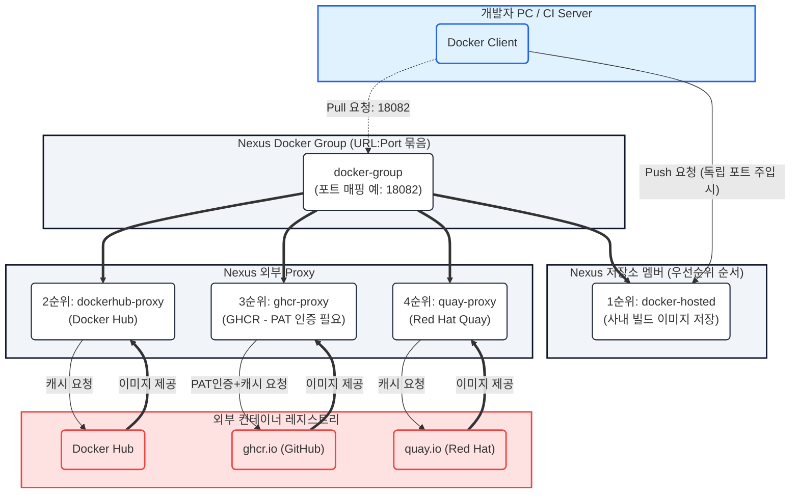
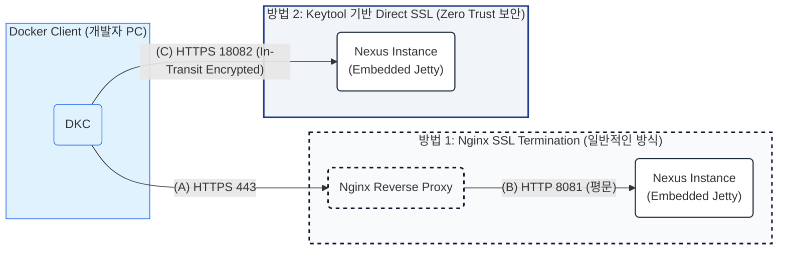

# Docker Registry 실무 적용

---

## 📌 목차
1. [Pain Point & Solution](#1-pain-point--solution)
2. [Docker Registry 아키텍처 (Hosted, Proxy, Group)](#2-docker-registry-아키텍처)
3. [TLS/SSL 적용: Nginx vs Keytool (Direct SSL) 상세 분석](#3-tlsssl-적용-nginx-vs-keytool-direct-ssl-상세-분석)
4. [사설 인증서(Self-Signed Certificate) 메커니즘 및 Trust Chain](#4-사설-인증서self-signed-certificate-메커니즘-및-trust-chain)
5. [멀티 Registry Proxy & Group 구성 메커니즘 (Docker Hub, GHCR, Quay)](#5-멀티-registry-proxy--group-구성-메커니즘)
6. [포트 분리를 통한 독립 Registry 노출 전략](#6-포트-분리를-통한-독립-registry-노출-전략)

---

## 1. Pain Point & Solution

- **Pain Point:** 사내 전용 Container Registry의 부재, Docker 통신 시 TLS/인증서 설정의 어려움, 외부 저장소(Docker Hub, GHCR, Quay 등) 접근 제어 및 다운로드 제한(Rate Limit) 문제.
- **Solution:** Nexus 3를 통한 단일 접점 구축, HTTP Listener 및 Keytool 기반 TLS 통신 구성, Proxy 및 Group Repository를 활용한 컨테이너 패키지 통합 관리.

---

## 2. Docker Registry 아키텍처



### 아키텍처 핵심 설명
- **Hosted Repository:** 사내에서 직접 생성하고 빌드한 커스텀 Docker 이미지를 저장 (Read/Write 권한 분리 대상).
- **Proxy Repository:** 외부 Docker Registry(Docker Hub, GHCR, Quay)의 캐시 저장소 역할 (Read Only).
- **Group Repository:** 여러 Hosted 및 Proxy 저장소를 하나의 URL/포트로 묶어서 제공하는 가상 레지스트리. Member List 우선순위에 따라 순차 탐색.

---

## 3. TLS/SSL 적용: Nginx vs Keytool (Direct SSL) 상세 분석



### 이론 심화: 보안 정책별 인증서 적용 비교
1. **Nginx SSL Termination:**
   - Client~Proxy 구간만 SSL 암호화. Nginx와 Nexus 간 내부 통신(HTTP 8081)은 평문(In-Transit Unencrypted) 전달.
   - **장점:** 중앙 집중식 인증서 관리 및 갱신 편의성.
2. **Keytool 기반 Direct SSL:**
   - Zero Trust 네트워크 보안 규정 준수. Reverse Proxy 내부 구간까지 포함한 **End-to-End In-Transit Encryption** 구현.
   - **설정 원리:** Java Keystore(JKS) 생성 후 Nexus의 Embedded Jetty 서버 엔진 설정(`nexus.properties`, `jetty-https.xml`)을 직접 수정하여 SSL Connector 활성화.

#### Keytool 및 Jetty 설정 절차 원리
```bash
# 1. Keystore 생성 및 Self-Signed 인증서 발급
keytool -genkeypair -keystore $NEXUS_HOME/etc/ssl/keystore.jks -storepass changeit -keypass changeit   -alias nexus -keyalg RSA -keysize 2048 -validity 365   -dname "CN=nexus.company.local, OU=DevOps, O=Company, L=Seoul, C=KR"

# 2. $NEXUS_HOME/bin/nexus.properties 수정
# nexus-args 설정 라인에 ${jetty.etc}/jetty-https.xml 추가 주석 해제하여 HTTPS Listener 엔진 활성화
nexus-args=${jetty.etc}/jetty.xml,${jetty.etc}/jetty-http.xml,${jetty.etc}/jetty-requestlog.xml,${jetty.etc}/jetty-https.xml

# 3. $NEXUS_HOME/etc/jetty/jetty-https.xml 수정
# KeyStorePassword 및 KeyManagerPassword 적용 및 HTTPS 포트 매핑
```

---

## 4. 사설 인증서(Self-Signed Certificate) 메커니즘 및 Trust Chain

### 사설 인증서 에러 발생 원리
Docker Daemon은 Go 언어의 TLS 표준 라이브러리를 사용하며, 기본적으로 호스트 OS의 Root CA Store(신뢰할 수 있는 인증기관)에 등록된 CA만 승인합니다. Self-Signed 인증서 사용 시 아래와 같이 Trust Chain 검증 실패 에러가 발생합니다.

> `Error response from daemon: Get "https://nexus.company.local:18082/v2/": x509: certificate signed by unknown authority`

### 해결책 메커니즘 비교
1. **`insecure-registries` 지정 (비권장/테스트용):**
   - TLS 검증 절차 자체를 무시(Bypass)하도록 Docker Daemon 동작을 변경. TLS 암호화를 해제하는 것과 같아 보안 정책 무력화.
2. **`certs.d` 경로 CA 인증서 주입 (운영 권장 - Truststore 확장):**
   - Docker Daemon이 특정 레지스트리(Domain:Port)와 통신할 때 고유하게 신뢰할 사설 CA 인증서를 추가 등록.
   - **주의사항:** Keytool에서 인증서 export 시 반드시 **`-rfc` 옵션(PEM 포맷)**을 부여해야 Docker Daemon이 정상 파싱할 수 있습니다.

```bash
# 1. PEM(ASCII) 포맷으로 Public 인증서 추출 (-rfc 필수)
keytool -exportcert -keystore $NEXUS_HOME/etc/ssl/keystore.jks -alias nexus -file nexus.crt -rfc

# 2. Docker Client truststore 확장 경로로 복사 (파일명 확장자 .crt 필수)
sudo mkdir -p /etc/docker/certs.d/nexus.company.local:18082
sudo cp nexus.crt /etc/docker/certs.d/nexus.company.local:18082/ca.crt

# 3. Docker Daemon 재시작
sudo systemctl restart docker
```

---

## 5. 멀티 Registry Proxy & Group 구성 메커니즘

### OCI / Docker v2 Spec 과 GHCR OAuth Challenge 문제
- **Docker Hub:** Remote URL: `https://registry-1.docker.io` (Anonymous Rate Limit 대응을 위한 캐싱).
- **GHCR (GitHub Container Registry) 검증된 설정:**
  - Remote URL: `https://ghcr.io/` (Trailing Slash 누락 시 OCI Redirect 이슈 발생 가능).
  - **GHCR 패키지 정책 핵심:** GHCR은 Public 패키지라 할지라도 **`read:packages` 권한을 가진 Personal Access Token(PAT)으로 인증되지 않은 요청에 대해 Layer 403 Forbidden 에러**를 반환합니다.
  - **해결책:** Nexus Proxy 설정의 `HTTP/HTTPS Authentication` 항목에 **Username(GitHub ID) 및 Password(PAT)**를 반드시 사전 등록해야 올바른 Authenticated Proxy로 동작합니다.
- **Quay:** Remote URL: `https://quay.io/`

```bash
# Group Repository를 통한 단일 창구 다운로드 테스트
docker pull nexus.company.local:18082/ubuntu:latest
docker pull nexus.company.local:18082/homebrew/ubuntu22.04:latest
docker pull nexus.company.local:18082/quay/busybox:latest
```

---

## 6. 포트 분리를 통한 독립 Registry 노출 전략

### 왜 Group 단일 통로 대신 레지스트리별 포트를 분리하는가? (Why Port Separation?)
1. **방화벽(ACL) 및 IP 통제:** 사내 네트워크 보안 정책에 따라 특정 부서/서버에만 특정 레지스트리 접근 허용.
2. **이미지 네이밍 충돌 방지:** 서로 다른 레지스트리 간 동일 패키지 이름(`ubuntu`, `nginx` 등) 혼선 차단.
3. **CI/CD 및 운영 트래픽 격리:** 배포 파이프라인 트래픽과 일반 개발 트래픽의 물리적 분리.
4. **Push/Pull 권한 오용 차단:** Push 전용(Hosted)과 Pull 전용(Proxy/Group)의 포트 격리.

동일한 Nexus 인스턴스 내에서 **Repository Connectors** 기능을 활용해 포트 단위로 저장소 접근 권한 및 물리적 통로를 격리합니다.

| Repository Name | Type | Assigned Port | 목적 및 보안 정책 |
| :--- | :--- | :--- | :--- |
| **docker-group** | Group | HTTPS 18082 | 개발자 공통 이미지 Pull 전용 (읽기 전용 창구) |
| **docker-hosted** | Hosted | HTTPS 18083 | CI/CD 파이프라인 전용 Push/Pull 창구 (격리) |
| **ghcr-proxy** | Proxy | HTTPS 18084 | 외부 GHCR 전용 독립 통로 |
| **quay-proxy** | Proxy | HTTPS 18085 | 외부 Quay 전용 독립 통로 |

---