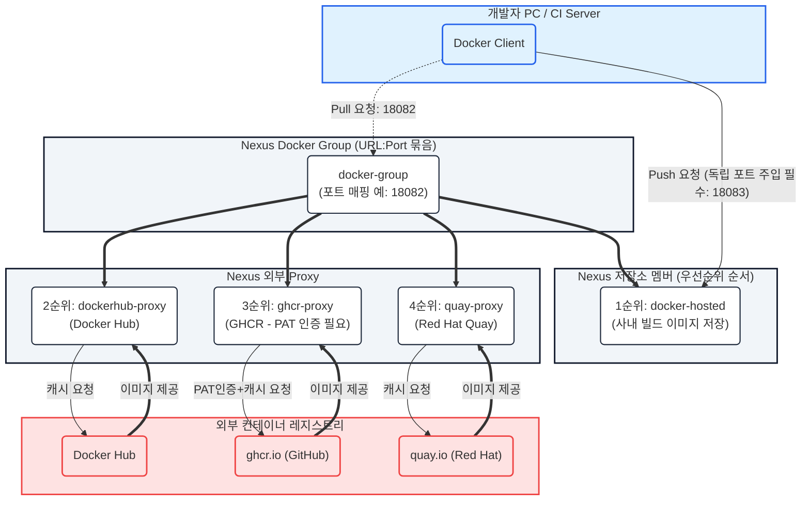
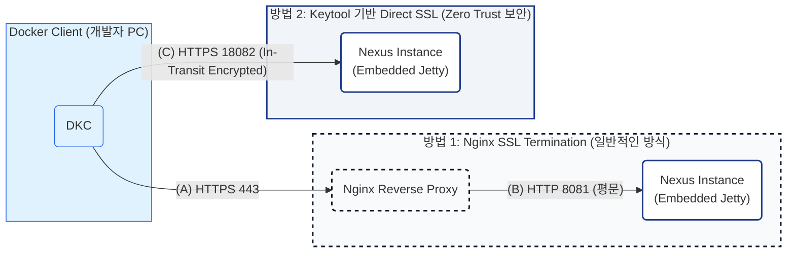

# Docker Registry 실무 적용

---

## 📌 목차
1. [Pain Point & Solution](#1-pain-point--solution)
2. [Docker Registry 아키텍처 (Hosted, Proxy, Group)](#2-docker-registry-아키텍처)
3. [TLS/SSL 적용: Nginx vs Keytool (Direct SSL) 상세 분석](#3-tlsssl-적용-nginx-vs-keytool-direct-ssl-상세-분석)
4. [사설 인증서(Self-Signed Certificate) 메커니즘 및 Trust Chain](#4-사설-인증서self-signed-certificate-메커니즘-및-trust-chain)
5. [멀티 Registry Proxy & Group 구성 메커니즘](#5-멀티-registry-proxy--group-구성-메커니즘)
6. [포트 분리를 통한 독립 Registry 노출 전략](#6-포트-분리를-통한-독립-registry-노출-전략)

---

## 1. Pain Point & Solution

- **Pain Point:** 사내 전용 Container Registry 부재, Docker 통신 시 TLS/인증서 설정의 어려움, 외부 저장소(Docker Hub, GHCR, Quay 등) 접근 제어 및 다운로드 제한(Rate Limit) 문제.
- **Solution:** Nexus 3를 통한 단일 접점 구축, HTTP Listener 및 Keytool 기반 TLS 통신 구성, Proxy 및 Group Repository를 활용한 컨테이너 패키지 통합 관리.

---

## 2. Docker Registry 아키텍처

### 아키텍처 핵심 설명
- **Hosted Repository:** 사내에서 직접 생성하고 빌드한 커스텀 Docker 이미지를 저장 (Read/Write 권한 분리 대상).
- **Proxy Repository:** 외부 Docker Registry(Docker Hub, GHCR, Quay)의 캐시 저장소 역할 (Read Only).
- **Group Repository:** 여러 Hosted 및 Proxy 저장소를 하나의 URL/포트로 묶어서 제공하는 가상 레지스트리. Member List 우선순위에 따라 순차 탐색.
  - ⚠️ **주의:** Docker API v2 Specification 규격상 Group Repository는 `docker push` 요청을 수신할 수 없으며(Read-Only), Push 시 반드시 Hosted Repository 전용 포트로 직접 요청해야 합니다.

---

## 3. TLS/SSL 적용: Nginx vs Keytool (Direct SSL) 상세 분석

### 이론 심화: 보안 정책별 인증서 적용 비교
1. **Nginx SSL Termination:**
   - Client~Proxy 구간만 SSL 암호화. Nginx와 Nexus 간 내부 통신(HTTP 8081)은 평문 전달.
   - **장점:** 중앙 집중식 인증서 관리 및 갱신 편의성.
2. **Keytool 기반 Direct SSL:**
   - Zero Trust 네트워크 보안 규정 준수. Reverse Proxy 내부 구간까지 포함한 **End-to-End In-Transit Encryption** 구현.
   - **사전 필수 작업:** Nexus 메뉴 `Security -> Realms`에서 **`Docker Bearer Token Realm`** 활성화 필수.

---

## 4. 사설 인증서(Self-Signed Certificate) 메커니즘 및 Trust Chain

### 사설 인증서 에러 발생 원리
Docker Daemon은 Go 언어의 TLS 표준 라이브러리를 사용하며, 기본적으로 호스트 OS의 Root CA Store에 등록된 CA만 승인합니다. Self-Signed 인증서 사용 시 Trust Chain 검증 실패 에러가 발생합니다.

> `Error response from daemon: Get "https://nexus.company.local:18082/v2/": x509: certificate signed by unknown authority`

### 해결책 메커니즘 비교
1. **`insecure-registries` 지정 (비권장/테스트용):**
   - TLS 검증 절차 무시. 보안 정책 무력화.
2. **`certs.d` 경로 CA 인증서 주입 (운영 권장):**
   - Docker Daemon이 특정 레지스트리(Domain:Port)와 통신할 때 신뢰할 사설 CA/Leaf 인증서를 추가 등록.
   - **핵심 특징:** `/etc/docker/certs.d/` 경로는 온디맨드로 로드되므로 **데몬 재시작이 불필요**.
   - **주의사항:** Keytool에서 추출 시 반드시 **`-rfc` 옵션(PEM 포맷)**을 부여해야 함.

---

## 5. 멀티 Registry Proxy & Group 구성 메커니즘

### OCI / Docker v2 Spec 과 GHCR OAuth Challenge 문제
- **Docker Hub:** Remote URL: `https://registry-1.docker.io`
- **GHCR (GitHub Container Registry):**
  - Remote URL: `https://ghcr.io/`
  - **PAT 필수 이유:** GHCR은 Public 패키지 조회 시에도 `read:packages` 권한의 Personal Access Token(PAT)으로 인증되지 않은 요청에 `403 Forbidden`을 반환합니다.
  - **GHCR PAT 발급 방법:** GitHub > `Settings` > `Developer Settings` > `Personal access tokens` > `Tokens (classic)` > `read:packages` 권한 체크 후 발급.
  - **Nexus 설정 위치:** Proxy 저장소 설정 내 `HTTP/HTTPS Authentication` -> `Username`에 GitHub 계정명, `Password`에 PAT 값 입력.
- **Group 라우팅 및 이미지 충돌 주의점:** 동일 이미지 이름(`ubuntu` 등) 조회 시 멤버 순서에 따른 혼선을 방지하기 위해 Nexus의 `Routing Rules` 기능을 설정하여 패키지 경로별 매핑 제어.

---

## 6. 포트 분리를 통한 독립 Registry 노출 전략

| Repository Name | Type | Assigned Port | 목적 및 보안 정책 |
| :--- | :--- | :--- | :--- |
| **docker-group** | Group | HTTPS 18082 | 개발자 공통 이미지 **Pull 전용** (Push 불가) |
| **docker-hosted** | Hosted | HTTPS 18083 | CI/CD 파이프라인 전용 **Push/Pull 창구** (격리) |
| **ghcr-proxy** | Proxy | HTTPS 18084 | 외부 GHCR 전용 독립 통로 |
| **quay-proxy** | Proxy | HTTPS 18085 | 외부 Quay 전용 독립 통로 |

---